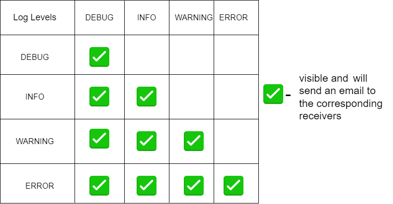

# Logger exercise

## 1. About project 
This repository provides a simple logging system that allows you to log messages with different log levels. It supports adding multiple log targets, including a console log target and email log target for sending log messages via email.

  

  

  

&emsp; Loggers allow messages to be categorized into different levels based on their importance or severity. This allows developers to control the amount of information logged at runtime, making it easier to focus on relevant details for debugging or troubleshooting.

&emsp; To enhance the efficiency of our log handling and focus on critical information, we can set the minimum accepted log level to Warning(for example). This configuration means that any logs with lower levels (Debug or Info in our case) will not be processed or handled by our system. Only logs with a level of Warning and Error will be accepted and given appropriate attention.

&emsp; This decision helps us prioritize the most important and potentially critical log events, ensuring that our attention is directed towards significant issues and reducing noise from less important log entries.

_____________________
_____________________

## 2. How to use?
Steps:
1. Clone this repository: git clone <repo - url>
2. Needed to turn on 2-step verification in your sender account settings, generate password for Python application(in "Select app" window choose "Other" and enter Python as app name). Replace sander password with generated in config.json file.  
3. cd to logger folder and replace receivers and sender info in config.json file.
4. To use this library import logger in your .py file and add this code in coresponding parts of code: 
<pre>
            from logger import *   
            logger = Logger(min_log_level=LogLevel.INFO)
</pre>

_____________________
_____________________

## 3. Improvement ideas
* Use database to store logs. 
* Add queue to multiprocess threading structure
